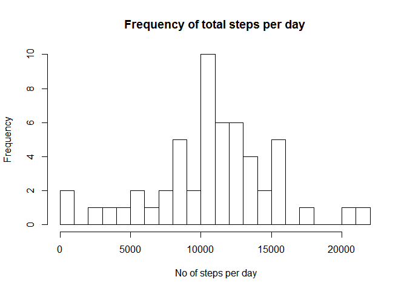
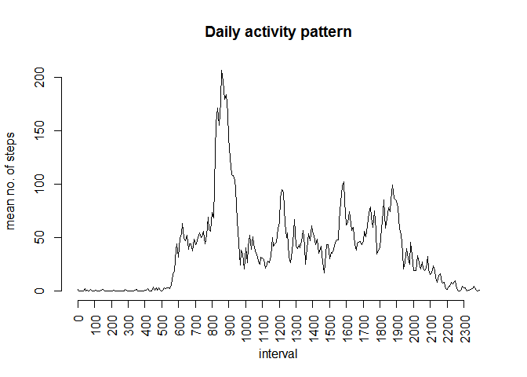
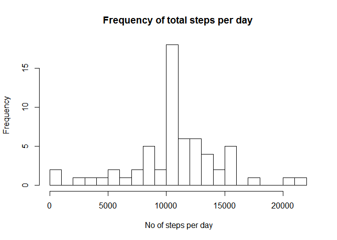
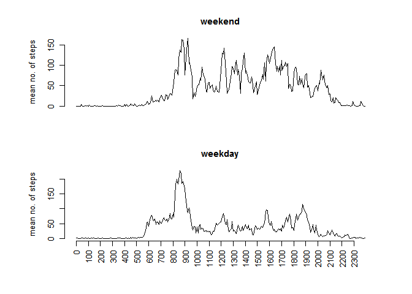

## Loading and preprocessing the data  

##### Unzip and load the raw data

```r
unzip("Activity.zip", overwrite=TRUE)
data <- read.csv("activity.csv")
```


## What is mean total number of steps taken per day?  

#### Summarise the total number of steps per day and create a histogram

```r
hist_data <- tapply(X=(data$steps), INDEX = data$date, FUN=sum)

hist(hist_data, freq =TRUE, main = "Frequency of total steps per day", 
     xlab=" No of steps per day", breaks=20)
```

<!-- -->

#### calculate the mean number of steps per day (missing values ignored) 

```r
mean(hist_data, na.rm=TRUE)
```

```
## [1] 10766.19
```

#### calculate the median number of steps per day (missing values ignored) 

```r
median(hist_data, na.rm=TRUE)
```

```
## [1] 10765
```
  

## What is the average daily activity pattern?

#### summarise the mean number of steps for each interval (missing values ignored)

```r
daily_data <- tapply(X=data$steps, INDEX = data$interval, FUN=mean, na.rm=TRUE)
```


#### plot the daily activity pattern

```r
plot(daily_data, type="l", axes=FALSE, main="Daily activity pattern", xlab="interval", 
     ylab="mean no. of steps")
axis(side=2)
axis(side=1, at = seq(1, length(names(daily_data)), 12), 
     labels=names(daily_data)[seq(1, length(names(daily_data)), 12)], las=2)
```

<!-- -->

#### Determine which 5-minute interval, on average across all the days in the dataset,
#### contains the maximum number of steps


```r
names(daily_data[which.max(daily_data)])
```

```
## [1] "835"
```

  
## Imputing missing values

#### Determine the total number of missing values in the dataset

```r
sum(is.na(data$steps)==TRUE)
```

```
## [1] 2304
```
  

#### create a new data set with the missing values estimated
##### (missing values are replaced with the mean for that interval)

```r
daily_data_df <- as.data.frame(cbind(names(daily_data), daily_data))
colnames(daily_data_df)<- c("interval","mean_steps")
new_data<- merge(data, daily_data_df, by="interval")
new_data$steps <- as.numeric(as.character(new_data$steps))
new_data$mean_steps <- as.numeric(as.character(new_data$mean_steps))

for(i in 1:nrow(new_data))
{
    ifelse(is.na(new_data$steps[i]),
      	new_data$new_steps[i] <- new_data$mean_steps[i],
	new_data$new_steps[i] <- new_data$steps[i])
}
```

#### summarise the total no of steps by day and create a histogram

```r
hist_data_new <- tapply(X=(new_data$new_steps), INDEX = new_data$date, FUN=sum)
hist(hist_data_new, freq =TRUE, main = "Frequency of total steps per day", xlab=" No of steps per day", breaks=20)
```

<!-- -->

#### calculate the mean number of steps per day (missing values estimated) 

```r
mean(hist_data_new)
```

```
## [1] 10766.19
```

#### calculate the median  number of steps per day (missing values estimated) 

```r
median(hist_data_new)
```

```
## [1] 10766.19
```

The results above show that the mean total number of steps per day is unchanged   
regardless of whether we ignore or estimate the missing values.

The median total number of steps per day increases slightly as a result of 
estimation of missing values  
( from 10765 ignoring missing values to 10766.19 estimating missing values ).  

  
## Are there differences in activity patterns between weekdays and weekends?
  
#### create a new factor variable in the dataset with two levels
#### weekend

```r
new_data$weekend <- grepl("S.+",weekdays(as.Date(new_data$date)))
daily_data_weekend <- tapply(X=new_data$new_steps[new_data$weekend==TRUE], INDEX = new_data$interval[new_data$weekend==TRUE], FUN=mean)
```
  
#### and weekday

```r
daily_data_weekday <- tapply(X=new_data$new_steps[new_data$weekend==FALSE], INDEX = new_data$interval[new_data$weekend==FALSE], FUN=mean)
```
  
#### plot the daily activity pattern for weekend and weekday using a panel plot

```r
par(mfrow=c(2,1), omi=c(0.4,0.1,0.1,0.1), cex=0.8, mai=c(0.5,1,0.5,0.5))
 
plot(daily_data_weekend, type="l", axes=FALSE, main = "weekend", ylab="mean no. of steps", xlab="", mai=0)
axis(side=2)

plot(daily_data_weekday, type="l", axes=FALSE, main="weekday", xlab="interval", ylab="mean no. of steps")
axis(side=2)
axis(side=1, at = seq(1, length(names(daily_data_weekday)), 12), labels=names(daily_data_weekday)[seq(1, length(names(daily_data_weekday)),12)],las=2)
```

<!-- -->

